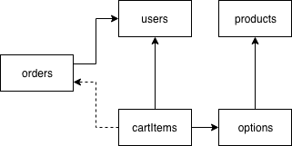

# 중간 프로젝트 개발 가이드

아래 요구사항을 충족시키는 쇼핑몰 웹사이트를 [Glitch에 올려둔 쇼핑몰 API 서버](https://glitch.com/edit/#!/fds-json-server-shop)를 사용해 구현해주세요.

- 최소 요구사항
  - 사용자는 **로그인**을 할 수 있습니다.
  - 사용자는 **카테고리**별 **상품 목록 페이지**를 이용할 수 있습니다.
  - 사용자는 **상품 페이지**를 통해 상품에 대한 자세한 정보를 확인할 수 있습니다.
  - 사용자는 **장바구니에 상품을 담거나 장바구니에서 상품을 제거**할 수 있습니다.
  - 사용자는 장바구니에 담긴 항목 **전체를 주문**할 수 있습니다.
  - 사용자는 **주문 내역을 확인**할 수 있습니다.
- 추가 요구사항
  - 사용자는 **회원 가입**을 할 수 있습니다.
  - 사용자는 장바구니 항목의 **구매 수량을 수정**할 수 있습니다.
  - 사용자는 장바구니에 담긴 항목 중 주문하고 싶은 것만 **선택해서 주문**할 수 있습니다.
  - 사용자는 상품 목록에서 **페이지**를 넘기며 상품을 탐색할 수 있습니다.
  - 관리자는 별도의 **관리자 페이지**에서 상품을 추가/수정/삭제할 수 있습니다. (id가 1번인 사용자를 관리자로 간주합시다.)

최소 요구사항을 모두 구현하기 전까지는 기능 구현에 집중해주시고, 최소 요구사항을 모두 구현하신 분들은 추가 요구사항을 구현할지, 디자인을 개선할지 선택하신 후 그에 맞게 작업을 해주세요.

## 페이지 구분 예시

- 홈 페이지
- 로그인 페이지
- 상품 목록 페이지
- 상품 상세 정보 페이지
- 장바구니 페이지
- 주문 내역 페이지

## 데이터 및 필드 설명

- `users` - 사용자
  - `id` - 식별자
  - `username` - 사용자 이름
  - `hashedPassword` - 암호화된 비밀번호
- `products` - 상품
  - `id` - 식별자
  - `category` - 상품 카테고리
  - `title` - 상품 이름
  - `description` - 상품에 대한 부가 설명
  - `mainImgUrl` - 상품 대표 이미지 URL
  - `detailImgUrls` - 상품 설명 이미지 URL을 담는 배열
- `options` - 옵션
  - `id` - 식별자
  - `productId` - 이 옵션이 속한 상품의 ID
  - `title` - 옵션 설명 텍스트 (예: '청색 S', '백색 M')
  - `price` - 가격
- `cartItems` - 장바구니 항목
  - `id` - 식별자
  - `userId` - 소유자 ID
  - `orderId` - 주문 ID (아직 구매하지 않은 항목인 경우 **-1**을 저장)
  - `optionId` - 이 장바구니 항목과 연결된 옵션 ID
  - `quantity` - 구매 수량
- `orders` - 주문
  - `id` - 식별자
  - `userId` - 소유자 ID
  - `orderTime` - 주문 시간 (유닉스 시간)

## 데이터 설명

아래는 데이터 간 부모-자식 관계를 그림으로 나타낸 것입니다. (화살표가 출발하는 쪽이 자식, 화살표가 도착하는 쪽이 부모)



- `products`는 상품, `options`는 상품에 속한 옵션을 나타냅니다.
- `cartItems`는 장바구니 항목을 나타내며, **어떤 옵션을 몇 개 주문할 예정인지**를 여기에 저장합니다.
- 옵션별로 가격이 다를 수 있으므로, 가격은 옵션 객체의 속성에 저장합니다.
- `orders`는 '주문 건'을 나타내는 데이터입니다. 사용자가 한 번 주문을 할 때마다 `orders` 배열에 주문 건을 나타내는 객체가 하나 추가되어야 합니다. 그리고 해당 주문 건에 포함되어야 하는 장바구니 항목들이 이 객체에 연결되어야 합니다.
- `cartItems` 배열에 저장된 장바구니 항목의 `orderId` 속성에 `-1`이 저장되어 있다면, 이 장바구니 항목이 아직 주문된 적이 없다는 사실을 나타냅니다. `orderId` 속성에 특정 주문 건의 ID가 저장되어 있다면, 이 장바구니 항목이 이미 주문되었다는 사실을 나타냅니다.

## 개발 가이드

요구사항에 적혀있는 **기능 단위**로 차근차근 개발해보세요. 'HTML 먼저 다 작성'하는 방식은 굉장히 위험한 방식입니다! 한 가지 기능에 대한 HTML, CSS, JS 모두 구현한 뒤 다음 단계로 넘어가세요.

CSS는 핵심적인 부분만 간략하게 작성하고 넘어간 뒤, 기능 구현을 모두 마친 후 3일차 정도에 마저 작성하시는 것을 권장합니다. 클래스가 너무 많아져서 관리하기 힘들 때는, [Sass의 nesting 기능](https://sass-lang.com/guide)을 사용하는 것을 고려해보세요.

---

쇼핑몰에서 보여줄 상품 및 옵션 데이터를 미리 `db.defaults.json` 파일에 어느 정도 작성한 후, `.data/db.json` 경로에 복사해서 작업을 시작하세요. Glitch 에디터는 JSON 파일의 에러를 제대로 잡아주지 못하므로, `db.defaults.json` 파일을 작성하실 때는 VS Code를 사용하거나 [JSONLint](https://jsonlint.com/) 등의 도구를 사용하는 것을 권장드립니다.

일단은 서버 사용법을 익히기 위해 이 문서를 정독하신 후, Postman을 가지고 서버에 직접 요청을 보내서 본인이 이해한 것이 맞는지 테스트해보세요.

테스트하다가 서버의 데이터가 오염되었다면, 다시 `db.defaults.json` 파일을 `.data/db.json` 경로에 복사해서 서버의 데이터를 초기화할 수 있습니다.

혹시 구현하시고 싶은 기능이 더 있거나, 다른 데이터 구조를 시험해보고 싶으시다면 데이터 구조를 얼마든지 바꾸셔도 괜찮습니다.

---

상품 이미지는 기존 쇼핑몰에 있는 것을 다운로드(혹은 캡처)해서 사용하시거나, 스톡 이미지 사이트에서 다운로드 받으세요. [Pexels](https://www.pexels.com/)같은 스톡 이미지 웹사이트에서 무료 이미지를 구할 수 있습니다. (shoes, sneakers, jeans, t-shirts, camera 등의 키워드로 검색해보세요.)

다운로드 받으신 이미지는 Glitch 서버에 업로드해서 사용할 수 있습니다. 페이지 좌측에 보이는 assets 메뉴를 클릭한 뒤, 좌측 상단의 `Add assets` 버튼을 클릭해서 이미지를 업로드하시면 각 이미지마다 URL이 생성됩니다. 이렇게 생성한 URL을 데이터 파일에 붙여넣어 사용하세요.

---

JavaScript 코드가 원하는대로 동작하지 않는데 에러가 나지도 않는 경우, 코드의 이곳 저곳에 `console.log(...)`를 넣어 코드가 의도대로 동작하고 있는지를 확인해보세요.

## 추가 요구사항 구현 시 참고사항

1. [회원 가입](https://github.com/fds9/fds-json-server#%EC%82%AC%EC%9A%A9%EC%9E%90-%EC%83%9D%EC%84%B1%ED%95%98%EA%B8%B0)
1. [X-Total-Count 헤더를 통해 자료의 개수 알아내기](https://github.com/typicode/json-server#slice) - `_page` 쿼리 스트링을 써도 응답에 `X-Total-Count` 헤더가 포함됩니다.
1. [JS에서 체크박스의 체크 여부 확인하기](https://www.w3schools.com/jsref/prop_checkbox_checked.asp)
1. [토큰과 연결된 사용자 정보 가져오기](https://github.com/fds9/fds-json-server#%ED%86%A0%ED%81%B0%EA%B3%BC-%EC%97%B0%EA%B2%B0%EB%90%9C-%EC%82%AC%EC%9A%A9%EC%9E%90-%EC%A0%95%EB%B3%B4-%EA%B0%80%EC%A0%B8%EC%98%A4%EA%B8%B0)
1. 관리자 페이지를 구현하실 때, 데이터 파일의 products 배열과 options 배열에 들어있는 모든 객체에 `"userId": 1` 속성을 추가해주세요. 이렇게 하면 상품 데이터 및 옵션 데이터는 1번 사용자의 소유가 되어, 1번 사용자가 이 데이터들을 수정할 수 있게 됩니다.

## API 요청 코드 예제 (`db.default.json` 기준)

### 상품정보를 모두 불러오고 싶은 경우

```js
await api.get('/products')
```

### 상품정보 중 'top' 카테고리만 불러오도록 필터링하면서, 옵션을 포함시키고 싶은 경우

```js
await api.get('/products', {
  params: {
    _embed: "options",
    category: "top"
  }
})
```

### 2번 상품의 Medium 옵션, 즉 3번 옵션 1개를 장바구니에 넣고 싶은 경우

```js
await api.post('/options/3/cartItems', {
  quantity: 1,
  orderId: -1 // 주문되지 않았다는 사실을 나타냄
})

// 혹은 이렇게 하셔도 됩니다.
await api.post('/cartItems', {
  optionId: 3,
  quantity: 1,
  orderId: -1 // 주문되지 않았다는 사실을 나타냄
})
```

### 아직 주문하지 않은 장바구니 항목을 불러오고 싶은 경우

```js
await api.get('/cartItems', {
  params: {
    orderId: -1
  }
})
```

### 장바구니 항목을 주문하고 싶은 경우

```js
// '주문' 객체를 먼저 만들고 나서
const {data: {id: orderId}} = await api.post('/orders', {
  orderTime: Date.now() // 현재 시각을 나타내는 정수
})

// 위에서 만든 주문 객체의 id를 장바구니 항목의 orderId에 넣어줍니다.
await api.patch('/cartItems/1', {
  orderId
})
```

### 1번 주문에 포함되어 있는 옵션 및 상품 정보를 모두 가져오고 싶은 경우

```js
// 먼저 orders, cartItems를 불러옵니다.
const {data: {cartItems}} = await api.get('/orders/1', {
  params: {
    _embed: 'cartItems'
  }
})

// 그 뒤 options, products를 불러옵니다.
const params = new URLSearchParams()
cartItems.forEach(c => params.append('id', c.optionId))
params.append('_expand', 'product')

const {data: options} = await api.get('/options', {
  params
})
```
